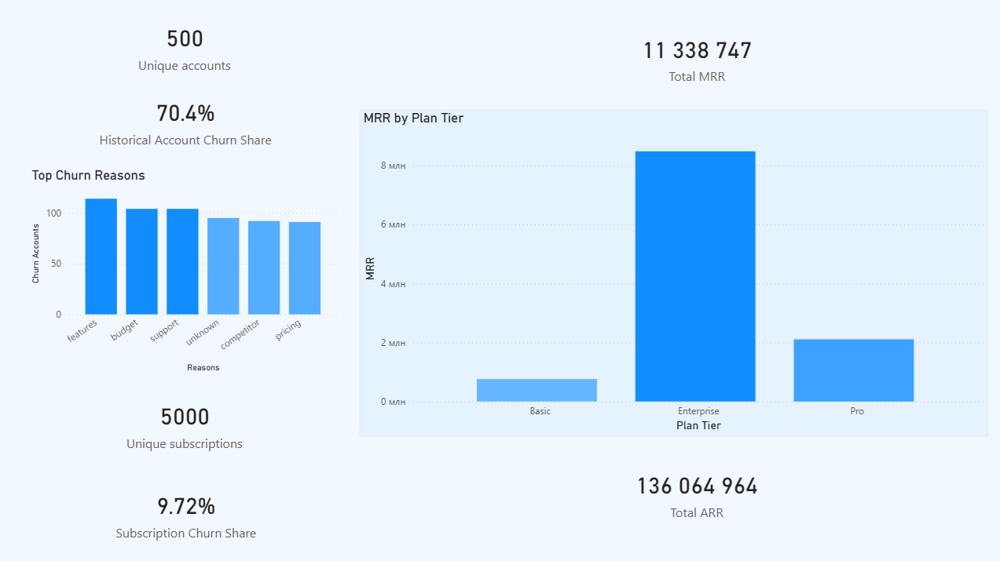

## Overview
This project analyzes a SaaS subscription dataset to understand churn patterns, compare churn at the account and subscription levels, identify the most common churn reasons, and highlight the plan tiers that are most important for revenue.

## Goal
The goal of the project is to explore how churn is represented in the dataset, identify major churn reasons, compare account-level and subscription-level churn, and show where the main revenue concentration is located.

## Dataset
The analysis is based on a multi-table SaaS dataset with the following tables:
- `accounts`
- `subscriptions`
- `feature_usage`
- `support_tickets`
- `churn_events`

## Main Questions
- How large is churn in the dataset?
- How does churn differ between accounts and subscriptions?
- What are the most common churn reasons?
- Which plan tier generates the most revenue?
- What parts of churn analysis are descriptive, and what requires deeper validation?

## Key Metrics
- Unique accounts
- Historical account churn share
- Unique subscriptions
- Subscription churn share
- Total MRR
- Total ARR
- Top churn reasons
- MRR by plan tier

## Dashboard
The dashboard shows:

- unique accounts
- historical account churn share
- unique subscriptions
- subscription churn share
- total MRR
- total ARR
- top churn reasons
- MRR by plan tier

## Key Findings
- The dataset contains 500 unique accounts.
- 352 accounts appeared at least once in `churn_events`.
- Historical churn and current churn are not the same metric.  
- `352` accounts had at least one churn event in history.
- `110` accounts are currently marked as churned.
- Historical account churn share is much higher than subscription churn share.
- The most common churn reasons include: features, support, and budget.
- `budget` and `pricing` are different reason categories in the dataset. Pricing exists as a separate reason, but it is not in the top 3.
- Enterprise generates the largest share of MRR, which makes this segment especially important from a business perspective.

## Interpretation
One of the main conclusions of the project is that churn should be interpreted carefully depending on the level of analysis.

At the account level, churn looks much higher because one account can appear in churn history more than once or return later. At the subscription level, the churn share is much lower. This suggests that `churn_events` reflect historical churn activity rather than a simple final loss of a customer.

From a business point of view, the most important segment is not only the one with churn events, but also the one that carries the most revenue. In this dataset, Enterprise is the most important plan tier by MRR.

## Limitations
- Churn reasons are descriptive and do not prove causality.
- `churn_events` reflect historical churn and may include reactivation cycles.
- Historical churn and current churn should not be mixed in one metric.
- Support and usage aggregates did not show a strong separating signal in the current analysis.
- The dashboard is a V1 version and focuses on the main metrics only.

## Product Hypotheses
- Support-related churn may be driven by patterns that are not visible in the current aggregated data. A deeper review of support interactions could help identify churn-related issues. Key metrics: satisfaction score, support ticket volume.
- Targeted retention offers for budget-sensitive accounts may reduce churn and improve retention without significant revenue loss. Key metrics: churn rate, retention rate, revenue.
- Non-churned accounts may share stable behavior patterns that can help explain retention. A deeper comparison of stable and churned accounts could reveal useful retention signals. Key metrics: churn rate, unique non-churned accounts in the long term.

## Next Steps
Possible next steps for deeper product analysis:

- validate the role of feature gaps in churn
- analyze retention actions by segment
- check whether churn patterns differ across high-value and low-value segments
- investigate whether support-related churn can be reduced with process improvements
- test product hypotheses for the most important revenue segments

## Stack
- PostgreSQL
- DBeaver
- Power BI
